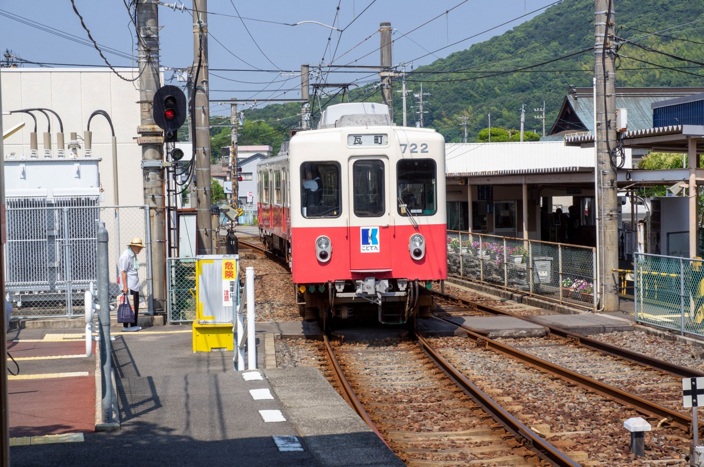
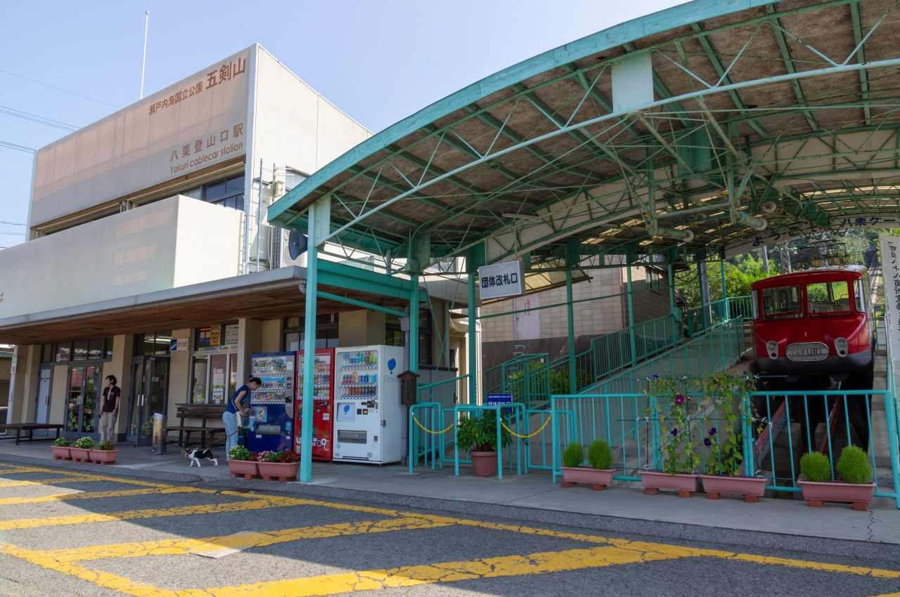
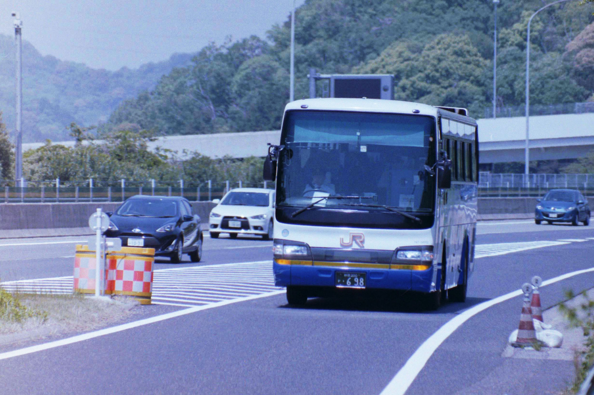
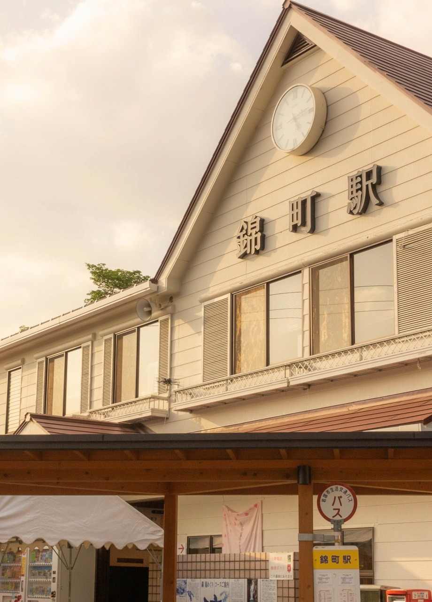
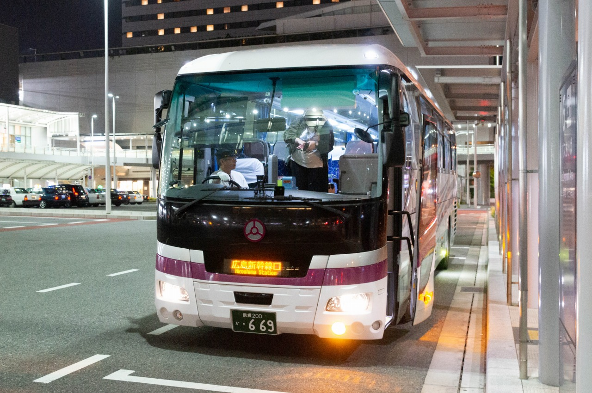
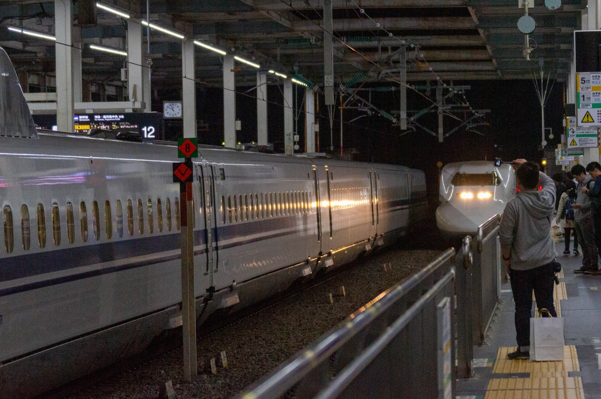
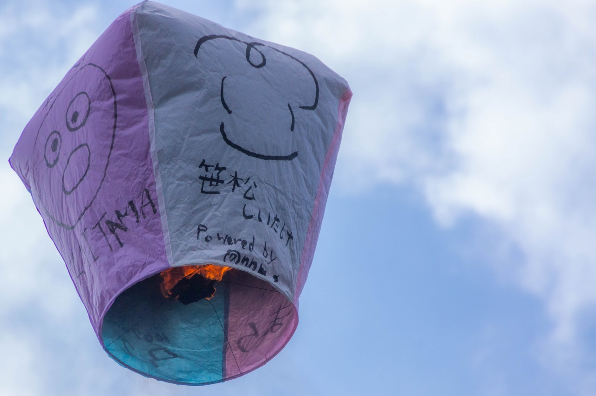

## まえがき

この度は本書を手にとって頂き、まことにありがとうございます。

乗り鉄、特に乗りつぶしを志す方においては、行き止まりの**盲腸線**に乗ったとき、終着駅に着いてから乗ってきた列車へそのまま乗り込んで引き返す単純往復 (物理現象の**単振動**と表現することもあるよう) をすることは少なくないのではないでしょうか。
もしくは、終着駅周辺へ立ち寄って列車を落としてから戻ることもあるでしょう。

これはこれで良い旅程であり楽しみ方は人それぞれだと考えていますが、折角ならば**行きと帰りのルートを変えてみたい**と考えることもあるかと思います。
その場合、駅から二次交通 (主にバス) を利用して他の路線へ乗り継ぐのが定番になるでしょう。
この行為を、本書では**脱出**と表現しています。
複雑な脱出ルートでは二次交通を複数乗り継ぐことや、県境を越える広域ルートを取ることもあります。

本書では、単純往復に飽きてしまった筆者、そして記事を寄稿してくれた、ぬえ (@sqen) と 銀河 (@mlginga) が試した脱出ルートをレポートしたものです。
乗りテツねっと内のコンテンツ 「**終着駅のない旅** (特に旧コンテンツ: http://noritetsu.net/archive_index.htm)」の情報量が多く参考にする方も多いと考えていますが、この本で執筆したレポートはいずれも掲載のないものです。

また、レポートの前には**脱出テクニック**として筆者が旅程を組むときの二次交通の選び方、乗り継ぎの小技などの情報をまとめています。
読者のみなさんが実施するときの参考にして頂ければ幸いです。

執筆陣のスケジュールの許す限り試行した縛りプレイ、読み物としてどうぞお楽しみ下さい。

## 脱出テクニック

終着駅からの二次交通でもっともポピュラーな手段は路線バスであろう。
さすがに現地ではバスのりばの案内はあるが、鉄道事業者のWebページにはバスの情報は少ない。**バス路線の情報はむしろWikipediaの方がまとまっており**、どんな路線があるかを把握してからバス事業者のWebページで時刻を調べるのがスムーズである。
廃止された国鉄/JR線の代替路線であれば大判時刻表にも路線と時刻が掲載されているが、そうでない路線は自分で調べないとなかなか見つからない。

バイパスが完成しても旧道から移されずに乗客を拾うルートを維持するため、北海道の長距離路線などを除き距離の割に所要時間が長くなってしまう傾向にある。

### バスのりば 駅前だとは 限らない (川柳)

~~大人の事情も含め~~駅前にバスが乗り入れない路線も少なくない。
表口とは異なるのりばを使用していたり、近くを通る幹線道路などから乗降することになる。
乗り継ぎ検索でも乗換駅として見なされておらず、検索してもヒットしないこともある。

乗車前にバス停の場所をよく確認しておくこと。
寄り道をする場合は、予めバス停の場所を確認してから駅を出ると安全である。

### 運転日に注意

お盆の中日にあたる平日は**JRは平日ダイヤ**、**私鉄は休日ダイヤ**が通例だが、バスにおいては**事業者によって異なる**。
大手事業者は休日ダイヤが適用されることが少なくないようだが、事業者へ事前に確認しておくと安全である。
~~筆者は確認を怠って奥津軽いまべつ駅で3時間待ちぼうけした~~

年末年始はほとんど休日ダイヤが適用されるが、多くのコミュニティバスの他、民間でも山交バスのように**元日は** (蔵王温泉線などごく一部の路線を除き) **全便運休になる事業者も存在する**ので要注意。
~~当分ないと考えたいが~~2019～2021年のように**特例で休日が追加、変更される時期**は更に変則的になる。

### コミュニティバスを駆使した盲腸線脱出

民間の路線バスが廃止され、自治体が運行主体となるコミュニティバスで代替されていることも多い。
盲腸線脱出では多かれ少なかれお世話になるものの、**民営の路線バスとは若干趣が異なる**。

朝夕は通学、日中は通院が主な需要であることから、路線によっては休日の日中便が運休になる、休日全便運休、平日でも特定曜日のみ運行される路線もある。
**社会人は休暇を何曜日に取得するのかも重要**。
閑散路線ではデマンド運行を採用している。
事前に電話することになるが、**携帯電話が通じない区間ではその場で申請できない**ので要注意。
衛星電話を持って行くのは非現実的なので、そのような場所から乗る場合は着く前に申請しておくこと。

ほぼ現金のみの対応で、都市近郊を除きICカード対応は期待できないのが現状。

#### Excel時刻表

自治体が運行主体ということもあるのか、時刻表がExcelの表で作成され、市町村のWebサイト内に置かれていることが多い。
階層が深いこともあるので、検索エンジンを使うと早く見つかる。
データが登録されていないこともあるので、乗り継ぎ検索は過信できない。

#### バス停はどこ?

旅行者の利用があまり想定されておらず、路線図は地図を使わない簡易図形式で、バス停の詳細な位置が分からないことも少なくない。
路線図そのものが用意されていないこともある。

その場合はGoogleマップやストリートビューでバス停の場所を確認する。
バス停の名前で検索するか、ストリートビューで付近の道路を当たってバス停のポールを確認する。

#### 車内アナウンスが無い

車内案内表示器や運賃箱、車内アナウンス、降車ボタンがないこともある。
フリー乗降制を採用している路線では申告すればすぐに降ろしてもらえるが、土地勘がない場所では予め下車地を申告しておくのが安全。

運賃箱に両替機能がない、定員が少なく満席では乗車できないという路線もある。
これらの細かな設備はWebページで記載されていることは少なく、**実乗するまで分からない**のが現状である。

### バス同士を乗り継ぐ

本数が少なく、幹線から支線へ分岐する路線では接続が考慮されたダイヤが組まれていることもあるが、**路線の多い都市部や異なるバス会社ではバスとバスの乗り継ぎはほとんど考慮されておらず**、乗り継ぎの案内すらないことも珍しくない。
乗り継ぎ検索サイトでもヒットしないことはざらである。

Googleマップなどの地図サイトで**近接する別のバス停を探す**のも有効。
最近では地図上のアイコンを選択すると路線と時刻が出るバス事業者もあるようだが、基本的にはバス停の名称を検索ボックスに入力して場所を探す。
コミュニティバスの項でも説明したようにそれでも場所が見つからないバス停も存在するので、それらはストリートビューで探す。
徒歩圏内にバス停があることを確認したら、両方の時刻表を突き合わせて乗り継げるか調べる。

### 高速バスを絡めた乗り継ぎ

高度なテクニックとして**高速バスが絡んだ広域な乗り継ぎ**も使える。
県を跨ぐような広域移動とバス停の配置次第だが、思いもよらぬ滅茶苦茶な脱出ルートも期待できる。

もっとも終着駅から徒歩圏内で直接高速バスに乗れる場所は少なく、大抵は路線バスなど二次交通を挟むことになる。
高速バスと路線バス、両方の発着時刻を精査することが重要だが、残念ながら両路線の接続が考慮されているとは限らない。

多くは起点付近では乗車専用、終点付近では降車専用となるが、国鉄～JRバスの老舗路線などでは高速道路区間にもバス停が設置されており、起終点付近を除き自由に乗り降りできる。
中には起終点付近の一般道区間のみを利用できる路線もある。

#### 高速道路区間での乗降

高速バスの高速道路区間ではパーキングエリア/サービスエリアやインターチェンジに併設のバス停、本線上のバスストップで乗降扱いを行う。
高速道路区間のバス停は他の公共交通期間が全く存在しないこともあり、駅から近い場合は徒歩で行けるが (東名江田、京都深草などが著名)、遠い場合はタクシーなどに頼る。
特に東京、大阪の一般道区間は渋滞が頻発することから、手前のバス停で下車して都心へは鉄道で向かうことで渋滞を回避することができる。

### バス以外の交通手段

- タクシー
  公共交通がない区間では最後の手段となる。ただし地方では営業時間が決まっていたり運行そのものが無いこともある。
- 航空機
  稚内空港や根室中標津空港、能登空港といった長大路線の終点付近にある空港では戻るにも時間を要すので非常に有効。
- 航路
  終点が港湾部にある、半島部の終着駅などで有効な手段少なくとも片方をバスと組み合わせるのが基本。長距離路線では宿泊費の節約にもなる。
  (ほぼ瀬戸内海限定だが) 航路とバスを組み合わせて離島経由で脱出する芸当もできる。
- 自転車
  列車での輪行が可能で、登り坂が続く区間でなければバスの代わりに自転車も選択肢に入る。レンタサイクルを借りるのも有効。

### おとなしく折り返す

~~これを述べてしまうのも本末転倒な気もするが~~脱出ルートは所要時間がかかる上に、運賃が嵩んでしまう。
潔く折り返した方が早く安く済むことも多い。
脱出ルートが複雑になるほどこの傾向は強くなる。
~~筆者のように単純往復しないのが目的なら止めない~~

## 事例集

### 琴電志度線 八栗駅 → 四国ケーブル 八栗登山口駅

実施: 2018年8月

四国ケーブルは85番札所 八栗寺へのアクセス路線で、水曜どうでしょうの企画「四国八十八ヶ所」にも登場している。

山麓側の八栗登山口駅へのアクセスは、公式には**八栗駅から徒歩20分**と案内されている。
地図では分かりづらいが、当然のことながらことでんの八栗駅からケーブルの駅までずっと上り坂である。
距離もどう見ても1km以上あり、相当な健脚でない限り20分でたどり着くのは困難であろう。

訪問したのが夏ということもあり、体力温存のために徒歩は回避したい。
しかし、八栗登山口駅は**公共交通機関の接続がない**。バスすら無い孤立路線なのである。

ここで役立つのが**レンタサイクル**で、八栗駅ではことでんが直営で貸し出しを行っており (https://www.kotoden.co.jp/publichtm/kotoden/new/2013/rent_cycle/index.html)、しかも電動アシスト自転車が用意されている。
山を登った先にあるケーブル駅へ行くにはうってつけの設備と言える。

筆者は旅程の都合で徳島に前泊し、特急うずしおで西へ向かった。
JRでの八栗寺の最寄り駅は特急の停車しない古高松南駅であるが、そこそこ離れている上に普通列車の接続もよくないので志度駅で琴電に乗り換えた。

{width=6cm}

八栗駅で下車するとレンタサイクルが直営のためか駅窓口がそのまま受付となっており、駅員に代金500円と保証金3000円を支払って自転車を借りた。
充電も満タンの状態でで引き渡された。

{width=5cm}
{width=5cm}

八栗登山口駅へ向かう道は2本あり、1本は駅前の道路を北へ少し行った所から折れる市道、もう1本は牟礼から登山口へ直結する県道である。
登っていく道へ入ってしまえば一本道であるが、駅周辺のルートが分かりづらいので各自Google Mapsなどで確認されたし。

往路は市道で向かった。
駅前の道路を曲がって市道に入ると電動自転車のモータが回ってグイグイ坂を登り、体力の消費が少なくて済む。
坂を登りきり、レトロな車両とプラットホームが見えたら八栗登山口駅に到着。
早めに漕いで10分程度で到着したが、念のため15分前後を目安に移動するとよい。
お手洗い横の軒下が駐輪場らしく、そこへ自転車を停めた。

{width=6cm}

ケーブルカーの乗車券を購入し、発車時刻が近づいたら乗り込む。
架線には照明や放送のための電力しか賄えないため冷房はない。
この日は8月の真夏日、暑い、それでも動き出したら風が入り込んでくる。
ところで、パンタグラフが山麓側に1つ、山頂側に2つ付いている。この構造は何?

ものの数分で八栗山上駅へ到着。
85番札所、八栗寺は駅と直結しており (表の参道は登山道とつながっているようだ)、30分もあれば一周できるだろう。
少し行った先にある「お迎え大師」像が展望台を兼ねており、柵もガラス張りで讃岐平野を一望できるようになっている。
目の前に見える丘が屋島で、かつてはこちらにもケーブルカーが存在した (設備そのものは残されていることがGoogle Mapsでも確認できる)。

{width=5cm}
{width=5cm}

ケーブルを降り、自転車で琴電屋島駅へ戻る。
復路は八栗登山口の駅前から伸びる県道で下った。
ほぼ下り坂でそのままでは速度が出すぎてしまうので、こまめにブレーキをかけることになる。
所々に交差点もあるので注意。

{width=6cm}

水曜どうでしょうで一行が訪れた「うどん本陣山田家」はこの道沿いにある。
この日は混雑していて時間が読めず、入口だけ確認して駅へ向かった。

琴電屋島駅へ戻ると小学生が社会科見学で駅を訪れて賑わっていた。
邪魔にならぬよう自転車を返却し、保証金の3000円を返却してもらって瓦町行きの列車へ乗り込んだ。

瓦町でうどんを食べてから高松築港へ移動し、四国フェリーの宇高航路で本州へと脱出した。
長い歴史のこの航路も、時代の波には逆らえず翌年に廃止されてしまうとは……

{width=6cm}

### 姫新線 中国勝山駅 → 山陰本線 倉吉駅

実施: 2021年8月

厳密には盲腸線ではないが、国鉄の未成線である南勝線 (鳥取県側は倉吉線) をたどるルートなので取り上げる。
岡山県真庭市の中国勝山駅から鳥取県の倉吉駅まで向かうルートで、ほぼ国道313号に沿っている。

岡山から中国勝山へは津山線・姫新線経由だけでなく、中鉄北部バスが運行する岡山～勝山の県内高速バスでも行ける。
津山線は概ね1時間毎、姫新線は1日12往復あるが、今回は ~~松山からしまなみ海道経由で向かったが故に~~ ダイヤの都合で津山線経由では乗り継げなかったためこちらを利用した。
1日4往復のみだが全便が蒜山方面への真庭市営バス「まにわくん♡」~~ハートマークまでが正式名称~~ と接続している ~~乗車した昼前の勝山行だけは40分待たされる~~。
(踏破後の調査で、備中高梁からバスを北房地区の呰部 (あざえ) で乗り継いで勝山へ向かうルートも確認した。実行した猛者は連絡ください)

高速道路を通るバスながら一般路線バスと同じ岡山駅東口からの発着で、9番のりばから乗り込む。当たった車両にはトイレがなかったので、事前に済ませておくのが良い。

{width=6cm}

この路線でクローズドドア運行となっているのは岡山市内だけのようで、岡山道上のバス停のほか、真庭市内相互間も運賃がちゃんと設定されていた。
落合ICで高速を降り、30分ほど国道を走行して勝山で下車。バス停の場所はなんの迷いもない中国勝山の駅前だった。

{width=6cm}

「まにわくん♡」では両替に対応していないそうで、予め駅の自販機で硬貨を用意しておいた。駅前には冷房の効いたバス待合室があり (JRの駅舎には冷房がない)、そこでも待つことができる。
緑色のバスが到着して乗り込む。白ナンバーを付けており、地方のコミュニティバスでよく見かける**有償運送車両**のようだ。

{width=6cm}

この「まにわくん♡」、踏破前に関金方面への系統へ時間的に乗り継げることは確認していたが、**Webで公開されている時刻表などにはどの停留場で乗り換えるか案内がどこにもなく**、ぶっつけ本番で攻めるしかなかった。
バスは旭川に沿う国道313号に入ると信号もほとんどなくなり、途中は湯原温泉を経由する。1時間程度で蒜山高原の入口に位置する**宮田**バス停に到着。

{width=6cm}

車内乗り継ぎの案内は何もなく、「こんな所で降りて大丈夫なのか?」と思いつつバスを下車。運転手に乗り継ぎを確認するも把握されていないようだった (一応、運行スタフを覗き見すると乗り継ぎ案内が書いてあった)。

バス停の目の前には「ふるさとふれあい特産館」なる小さな直売所があり、ここで補給が可能である。乗り継ぎまで15分くらいしかなかったがジャージー牛乳のソフトクリームを食べて県境越えに備えた。バス停は片側にしか立っておらず、「勝山方面は反対側で待て」とある。関金方面はここで北から来た道を戻ってから分岐するため、特産館側で良いらしい。

{width=5cm}
{width=5cm}

気持ち遅れて白ナンバーの白いコースターが到着。「中曽・関金ルート」と貼ってあるのでこれで良いらしい。この手のバスでは自動放送がなかった経験から、予め「終点まで」と告げて乗り込む。運賃箱はなくなりお皿だけで、案の定自動放送もなかった。

{width=6cm}

バスは犬挟 (いぬばさり) トンネルを抜けて鳥取県へ入ると急に景色が変わり、山の斜面にへばり付く高架橋へ放り出されてはるか下に集落が見える。岡山側が高原のためこのような片勾配になっているようで、バスは長い距離をかけて下っていく。
山を降りると程なく関金温泉へ到着。倉吉線のルートをたどる日本交通のバスへ乗り継ぐ。

{width=4cm}
{width=6cm}

この路線をはじめ、倉吉の路線バスの多くは外れにある倉吉駅と市街地の打吹を結んでいることからこの区間に入ると乗客が多くなる。40分くらい揺られていただろうか、倉吉駅のバスターミナルで放り出される。
ここ倉吉はいくつかのコンテンツでモデルに選ばれており、駅には以前からあったひなビタだけでなく、宇崎ちゃんPOPも置かれていた。
キャンペーンによりJ-WESTカード + e5489で指定券を500円で出せたので、特急スーパーまつかぜに乗って鳥取へ向かった。

{width=6cm}
{width=4cm}

### 名鉄名古屋本線 本宿駅 → 大山観光電鉄 大山ケーブル駅

実施: 2018年4月

鶴橋7:06発の名阪甲特急 (アーバンライナー) で大阪を出発。
普段の旅行は7～8時に家を出るよう調整している身としては、朝早い出発で目をこすりながらの移動がしんどいものだ (新幹線を使えば1時間遅くできたとはいえ)。
それにしても鶴橋駅は長距離列車の多さと利用者の多さの割に弁当販売が貧弱で、ファミマ程度しかない。当然ながら駅弁は売っていない (難波から乗ると弁当屋がある)。

{width=6cm}

朝早かったこともあって車内ではだいたい寝ており、2時間で近鉄名古屋駅に到着。
名鉄名古屋駅は壁一枚隔てた反対側で乗り継ぎ改札もあるが、時間に余裕があるので一旦改札外に出る。
待ち時間を利用してJRの売店で駅弁を物色し、ひとつ購入する。

列車の時間が近づいてきたので、地下に戻って名鉄名古屋駅の改札に入る。
3面2線の狭いホームで次から次へと来る列車を捌く光景は健在だが近年は日中の列車の削減が進み、4分ほど開く時間も珍しくなくなった。
対応する乗車位置で待って名古屋本線は豊橋行の急行に乗車。休日午前中の6両編成ということもあり難なく着席。

{width=6cm}

鳴海で特急に追い抜かれる。名古屋市を出ると直線区間が多くなり、3R運用の豊橋急行ということもあり115km/hで快走する。
東岡崎を過ぎると自然が多くなり、本宿で下車する。特急が停車しないので急行で乗り通しても4分しか変わらない。

急行停車駅なので売店があると高をくくっていたら無かったが、駅前には道の駅があるようだ。名鉄の高架沿い、名古屋方面に10分ほど歩くと東名本宿バス停に着く。
ここは東名ハイウェイバスのバス停の中でも鉄道駅と連絡が容易なことで知られている。

{width=6cm}

高速バスは名古屋駅始発なので乗り通しても良いように見えるが、ここ本宿から乗車したのには意味がある。
東名ハイウェイバスは名古屋市内では東山線沿線で乗客を拾っていくのと、また名古屋高速がなかった頃の名残で名古屋IC (名東区の端にあり、実質的に名古屋東IC) から流入する。
このため東京～名古屋の所要6時間のうち1時間近くを名古屋市内の移動に費やしており、市内で数少ない東西連絡を担う (2号東山線全通でかなりマシになったが) 幹線道路の錦通・広小路通の交通量も多いので渋滞にも捕まりやすい。
名古屋～本宿を名鉄で移動すると1時間もかからないので、その分名古屋駅での滞在時間を稼げるというからくりである。
今回は稼いだ時間を利用して駅弁を調達した。

乗車予定は10:51発のスーパーライナー60号。想定通り、定刻になってもバスは来ない。バスロケでは10分程度の遅延と出ている。
この日は新東名が事故渋滞で新東名スーパーライナーが東名高速へ迂回しており、待ち時間を利用してフィルムカメラで撮影して遊んでいた。
20分ほど遅れてバスが到着、Web乗車票を見せて乗車。GWということもありほぼ満員御礼。

{width=6cm}

途中の停留所での乗り降りが多く、急行東海を彷彿させる使われ方をしている。
特に静岡から西では一旦本線を出てICで乗降扱いを行う停留所が多い。停車の度に乗車券の確認や荷物の出し入れが発生するため、どうしても遅延を引きずりやすい。

浜松SAでの休憩で簡単な土産を仕込んでバスに戻る。
経験上、東名経由は休憩時間が10分程度しか確保されないことが多い。新東名経由では20分程度確保してもらえることが多いので、買い出し目当てならそちらが推奨。
浜松を出て駅弁を開ける。
今回購入したのは松浦商店の「海女の玉手箱」。
名古屋駅では珍しい海の幸の駅弁で、下の段にはご飯が、上の段にはおかずが少量ずつ詰められている。

{width=6cm}

東名静岡に着く頃には30分遅れになっていた。JR東海バス運行便のみ運転手交代で10分停車するので、この時間で遅れを若干巻いて発車。
静岡を過ぎると停車駅が少なくなり、東名御殿場でアウトレット客を拾って足柄SAでの10分休憩。
3時間かけて静岡県を抜け、東名伊勢原で下車。

ここで下車すると、高速から出た最寄りの「〆引」バス停で大山ケーブル駅行の路線バスに直接乗り継ぐことができるのだ。
大山ケーブルに西からアクセスすると東海道線・東海道新幹線～小田原～小田急～小田原～神奈中とどうしても手間を要してしまうが、高速バスを使うと一気にアプローチできる。
ちなみに伊勢原～大山ケーブルのバスは臨時の直行便も存在するが途中の停留所には止まらないので各停便のみ利用できる。それでも20分毎にあるのですぐ乗れる。

{width=6cm}

バスに乗って10分くらいで大山ケーブルバス停に到着。この先は参道で、徒歩でしか入れない。
スーツケースを持参していて観光案内所の手荷物預かりに出したかったものの、17時までに引き取りに行かねばならず断念。
仕方ないので、スーツケースを引っ張ったまま階段だらけの参道を歩きケーブルカーに乗り込む (このため納品業者と間違えられた)。
数年前に入れ替えられたピカピカの車両 (サービス電源用のバッテリを搭載しているので、架線が停止位置付近にしかないのに注目!) に乗って大山阿夫利神社を目指す。
途中、国内のケーブルカー唯一の交換駅である大山寺駅で下ってくる列車とすれ違う。

{width=5cm}
{width=5cm}

阿夫利神社駅に着くと本殿は目の前。参拝してから隣の茶屋で草だんごを注文し、休憩してからケーブルカーで下山。

{width=5cm}
{width=5cm}

帰りのバスは直行便。伊勢原駅までの途中のバス停には止まらない。
ここからは小田急に乗って町田で横浜線に乗り換え、予約していた橋本のホテルへ向かった。

{width=6cm}

### 錦川鉄道錦川清流線 錦町駅 → 山陽本線 広島駅

実施: 2019年5月

錦町駅からの脱出ルートは旧岩日線に沿って日原へ出るか、途中の島根県は六日町で広島～益田を結ぶ高速バス「広益線」を拾うルートが「終着駅のない旅」でも紹介されている。
ただし六日町へのバスは平日ダイヤでは日中にもあるが、休日は朝晩の2往復のみで旅行者の利用は困難。

一方で高根線は本数が多く、雙津峡温泉、深谷峡温泉を経由することから旅行者の利用も考慮されている。
このうち1日1往復のみ深谷峡温泉の先へ乗り入れる (休日以外は寂地線のデマンドバスもある) ことに今回は目を付けた。

当日は三津浜港から防予フェリーで柳井港へたどり着き、乗りつぶしの都合で櫛ケ浜から岩徳線経由で岩国へ入る。
筆者はこの岩徳線を最後にJR西日本を完乗した。

次の錦川清流線の列車までは時間があるので、商店街のゲームセンターまで出向きbeatmaniaIIDXの行脚を済ませる。
このゲームは踏破した都道府県や店舗数が記録され、海外 (主に韓国、台湾、香港) に設置された店舗まで出向くプレイヤーもいる。
毎年のバージョンアップで記録がリセットされるため、その度にやり直すことになる。

おなじみのNDCに乗り錦町駅を目指す。珍しく転換クロスシートが配備されている。
川西駅までは岩徳線への乗り入れ区間で、ここから錦川清流線に入る。
列車は一部トンネルでショートカットする区間もあるもののほぼ全線で錦川西岸に沿って走行する。
線内唯一の交換駅である北河内駅で対向列車をやり過ごしたのち、「出られない駅」として新設されたばかりの**清流みはらし駅**を通過。
出口が工場と直結している鶴見線の海芝浦駅とは異なり、本当に出口が存在しない。
したがって乗客はイベント列車で訪問してそのまま同じ列車に戻ることになり、定期列車は停車しない。

{width=5cm}
{width=5cm}

錦町駅へ到着したのち、予定より1本早い市営バスに間に合うのでまずは道の駅「ピュアラインにしき」へ向かうことにした。
この日は10連休で平日ダイヤが適用されたため、六日町行が運行されており錦町駅で目撃してしまった。
これに乗れば温泉入れたのに……

{width=4cm}
{width=6cm}

バスにはアナウンスが無く、フリー乗降制のため降車ボタンを押すとすぐに止まって道の駅まで少し歩く羽目になってしまった。運賃箱はないが小銭の持ち合わせがないときは手で両替してもらえる。
道の駅では各系統が接続するダイヤが組まれており、ハイエースが3台揃う。
高根線の地蔵前行に乗り込む。土地勘もないので、今度は「深谷パーキングまで」とあらかじめ行先を告げて乗車。

{width=5cm}
{width=5cm}

雙津峡温泉までは岩日線未成区間の高架が見える。
どうやら六日市までは最短の国道187号沿いではなく、国道434号に沿ってからトンネルで一気に抜ける計画だったようだ。
錦町駅～雙津峡温泉の区間は「とことこトレイン」として、この未成線を愛知万博で「グローバル・トラム」として使用されたバッテリーカーで乗車することもできる。

{width=6cm}

深谷峡温泉を過ぎると細い山道に入り、山を越えて小さな盆地に出ると「深谷パーキング」バス停に到着 (ギリギリ山口県)。
ここで下車。

バス停の目の前の通用口から中国道の深谷 (ふかたに) PA (上り線) の敷地に入れる。
ここ深谷PAはトイレしかない無人のパーキングエリアながら、高速バスのバス停があり広島～益田を結ぶ広益線が停車する。
この広益線はもともと一般道経由だったためクローズドドア方式が採用されておらず、区間利用も認められている。

{width=5cm}
{width=5cm}

30分くらいで石見交通の広島行最終便が到着。縦10列と広々としているがトイレがないので、事前に済ませておくのが無難。
この便への乗り継ぎは深谷PAを使うのがミソで、六日町への最終便に乗ると乗り継ぎに間に合わないが、深谷では乗り継げてしまうのだ。
中国道でも閑散区間のため車は少なく、大きな遅れもなく広島へ向かう。広島西風新都ICで流出し、広島高速4号線を経由して広島バスセンター、そして広島駅新幹線口に到着。

{width=6cm}

乗り継ぎ時間が1時間程度しかないので、下車とともに南口から道路を挟んで向かいの「広島フルフォーカスビル」へ直行。
ここの6Fはお好み焼き店が密集している。
21時前になるがオーダーを受け付けている店舗もそれなりにあり、空席のあるお店でお好み焼きとがんす (すり身にパン粉を付けて揚げた料理。徳島のフィッシュカツに近い) を注文して急いで食べる。

駅に戻り、山陽新幹線上り最終1本前のひかり444号に乗車。来たのは当時引退間近の700系B編成。
3色LEDと紺色の座席が印象深い。

{width=6cm}

車内販売で**シンカンセン・スゴイカタイアイス**で知られるアイスクリームを注文。
山陽新幹線ではJR西日本系の車内販売会社が担当するため東海道新幹線とは品目が異なり、大山牧場の商品が積み込まれていた。

終電間際、23:32に終点の新大阪駅に滑り込む。
列車を乗り継いで帰宅すると午前様であった。
~~2021年3月のダイヤ改正で終電が繰り上げられてしまったので、この時間の帰宅はもう実行できない~~

### 東海道本線 名古屋駅 → 城端線 城端駅

実施: 2018年10月

この日は実家に寝泊まりしたのにもかかわらず睡眠薬を忘れてろくに寝られず、翌朝休日診療へ飛び込んで処方してもらった。
明け方まで寝付けずげっそり。

大須で所用を済ませてから名古屋駅で駅弁を購入し、ミッドランドスクエア前からイルカ交通「きときとライナー」高岡行に乗り込んだ。
新規参入組ゆえバスターミナルを使用せず路上で客扱いする点をサービスでカバーしている。独立3列シート (しかも縦9列で広い!) で、毛布や新聞の貸し出しを行っている。
経由が若干異なる加越能バスも城端SAに停車するため連絡は可能。好きな方に乗車すれば良い。
有効期限なしのスタンプカードも渡され、6乗車で1回無料になる。

{width=5cm}
{width=5cm}

バスは名古屋高速6号清須線、16号一宮線、名神高速経由で東海北陸道へ入り、岐阜県に入って日本唯一の淡水魚専門水族館「アクア・トトぎふ」が見えたあたりで駅弁を開ける。
名古屋駅の駅弁はラインナップの入れ替わりが激しく、寄る度に買い求めてもなかなかコンプできない。
今日は「だるま」の「名古屋ベトコン弁当」。「ベストコンビ」の略と称しているが、ご当地グルメのベトコンラーメン (表向きには「ベストコンディション」の略とされる) に因んで名付けられたものとみられる。
飲み物は名鉄百貨店にある北海道アンテナショップ「どさんこプラザ」で調達したコアップガラナ。すごい組み合わせ。

{width=7.5cm}

途中ひるがの高原SAで休憩。「ひるがの高原のむヨーグルト」を買って補給。
敷地には展望台もあるものの、当時は絶賛4車線化工事中で生コン工場しか見えない。なんてこったい。

{width=7.5cm}

飛騨清見ICを過ぎると全長約11kmの飛騨トンネルに入る。
東海北陸道でも最後に開通した区間で、ボーリングマシンが動けなくなるほどの難工事だったと当時の新聞記事では度々取り上げられていた。
入口だけでなくトンネル内にも数ヶ所信号機があり、「出口○km」が流れる電光掲示板も設置されている。
しかしながら、この長さで県境をまたがないのもまた珍しい。

白川郷ICを過ぎると富山県に入る。
五箇山IC口で観光客を降ろし、城端トンネルを抜けてしばらく走ると城端SAに到着。ここで下車。
バス停は隣接するハイウェイオアシス側の駐車場にあり、P.A.WORKSのアニメスタジオが隣接している。
城ヶ池クアガーデンと呼ばれる温浴施設を併設しており、高速バスのバス停から一般道へ出ると入口にたどり着く。
ここのロータリーに南砺市コミュニティバス「城ヶ池クアガーデン」バス停があり、城端駅へ乗り継ぐことができる。
両者のバス停は目の前にあるにもかかわらず接続は考慮されておらず、高速バス側も特に乗り継ぎの案内はない。

予め接続の良い便を選んでいたのでハイウェイオアシスで時間を潰していると南砺市コミュニティバス「なんバス」が到着。
なんか凝った装飾のポンチョが来たぞ。
バスは福光駅まで向かうが城端駅で下車する。
乗車時間は短く20分程度で到着。

{width=5cm}
{width=5cm}

城端駅は木造の渋い駅舎で、観光案内所で乗車券の発売もある ~~壁には運行情報を表示するiPadが封印されていた~~。
ここからは城端線のキハ40に乗り込んで高岡を目指す。トイレには「停車中は使用しないでください」とある。水が流れないからと説明があるが、何故?
ホテルは新高岡に取っていたが、万葉線に乗りに行くのも兼ねて一旦高岡まで乗り通し、ひとまずミッションコンプリート。

{width=5cm}
{width=5cm}

コカ・コーラの広告電車に乗り込む。車内広告は10年以上前に発売された「コカ・コーラC2」の広告が未だに入っており、両替機は機械式。時代が止まっている。
Webで「万葉線で寿司を食べに行こう」なるチラシを見つけ、ノンストップで喋り続ける立川志の輔の観光アナウンスをBGMに新港の寿司屋へ向かった。

{width=5cm}
{width=5cm}

城端までの広域アクセスとしては白川郷を経由するルートも存在する。
世界遺産だけあって名古屋、金沢、高岡、城端、高山からバスが出ておりこちらでのアクセスは比較的容易。
一方で越美南線から荘川を経由して白川郷入りするルートは人口希薄地帯ゆえ2018～19年で白鳥交通のコミュニティバスや岐阜バスの高速バスが相次いで廃止され、連絡が不可能となってしまった。

### 台鉄平渓線 菁桐駅 → 台北捷運文山内湖線 木柵駅

実施: 2019年9月

比較的簡単な乗り継ぎルートだが、海外での実践例として取り上げる。

海外の鉄道やバスは日本とは文化がかなり異なり、日本の常識は通用しない。ダイヤや乗り方が突然変わることも茶飯事である。
日本語の情報は国内以上にアフィブログが多いので当てにならず現地語のWebサイトや公式アプリに頼るのが確実であるが、そもそもラテン文字圏や漢字圏でない地域では文字さえ読めず更に苦労する。
実際のところ**国や地域によりけり**としか言いようがないので、各自事前によく調べてから渡航されたい。

台湾鉄路管理局の非電化ローカル線である平渓線は終点の菁桐駅で行き止まりである。
折り返し列車で戻っても味気ないので、別のルートを使えないか出発前に調査していた。
十分～木柵を結ぶ台北客運の795系統が設定されており、これに乗ると文湖線木柵駅へ出られることから効率良く周遊できる。
20～30分毎に運転され十分～菁桐では鉄道と並行しており、むしろ1時間毎の平渓線よりも本数が多い。

この日は九份に宿泊しており、往路はバスで瑞芳へ戻ってから平渓線へ向かうオーソドックスなルートを選んだ。
(この九份も海外旅行慣れしていないとアクセスに難儀する場所である。台北市内から直通する (ただし台北駅には入らない) 965系統は積み残しが多く、鉄道で行くにも瑞芳 (優等はあまり停車しない) での乗り継ぎを要する。復路のバスも積み残ししやすく、タクシーを呼んでも行先を主張しないと台北市内まで乗せられたりする。おそらく現地日帰りツアーを使うのが楽)
九份からバスで瑞芳に着くと同行のたかまろ (@x_tkmr) がATM目的に駅前のセブンイレブンに駆け込む。

{width=5cm}
{width=5cm}

氏には「1万台湾ドル (=約35000円) 持ってきて」と伝えたはずが、なぜか「3000円で良い」と桁を間違えており、桃園空港で800台湾ドルしか両替をしておらず、昨日の夕食代すら払えなかったのだ。
何回か触っても引き出せなかったらしく、別のATMで当たることにして列車に乗り込んだ。
平渓線の列車は第3月台 (プラットホームのこと。ホーム単位で番号を振るため、島式ホームの乗り場は1A、1Bのように付番する) から発車する。
現地は中秋節で3連休の初日ということもあり、DR1000形の4両編成はぎゅうぎゅう詰め。

{width=6cm}

車窓もろくに見えない状態で途中駅の十分駅で降りた。

ここ十分では線路脇すれすれにランタン上げが出来る店が多数あり、単色150台湾ドル、4色200台湾ドルくらいで願い事をランタンに描いて空へ飛ばすことができる。

{width=6cm}

身内の間で同人作家の笹松しいたけ (@s_sasamatsu) のアイコンを描くことが半ばお約束となっており、筆者も描いてきた。
手本として、氏が友人の企てにより突如台湾へ連れて行かれた顛末記「拉致られて台湾島」の表紙を見ながら描いており、店員に貸し出される事案が発生した。
たかまろは本人の顔文字やコバトンを描いていたし、誰一人願い事書いてないじゃん? まあいいか。
空には他の客が飛ばした多くのランタンが上がっている。燃え尽きると落ちてくるようで、さすがに軌道敷に落ちると店員が拾いに行っていた。

{width=6cm}

1時間後の次の便で終点の菁桐へ向かう。
ここ菁桐はもと炭鉱街でその時代の建物を改装した飲食店があり、駅の裏手にも喫茶店があるのが見えたのでそこで昼食。
列車が来たときに席を外して写真を撮っているもので、鉄路迷 (鉄道オタク) であることがあっさりバレる。
ちなみに菁桐でもランタンを飛ばすことはできる (十分より安い)。

{width=6cm}
{width=4cm}

菁桐駅では駅前にバスが乗り入れておらず、少し歩いた幹線道路沿いに発着する。
バス停にはくるくる回せる筒状の路線図が取り付けられており、ここでバスが来たら手を挙げて (必ずしも上に挙げる必要はないようで、横に伸ばしても良いらしい) 乗車の意思を示すと停車してくれる。
山間の道路を走るためよく揺れるが座席数は少ない。車内のポールに掴まって耐え抜く。
795系統は観光地を結ぶ路線ということもあり、主要なバス停に限り日本語アナウンスも収録されている。
車内前方には最近の日本のバスにもあるような液晶の案内表示もある。
途中、「臨時駅」なるバス停が多数あるのは何故?

{width=6cm}

深坑に入ると乗客が増え、菁桐を出て1時間少々で木柵駅へ到着。
台湾のICカードである悠遊カードで運賃を払う。バスの運賃箱には両替機能がないので、事実上ICカードが必携と言える。チャージはMRTの駅のほかコンビニでも可能。
目の前にはセブンイレブン柄のクレーンゲーム店がある。ナニコレ?
たかまろは駅のATMでも引き出しを試みていたが、ことごとく失敗。カードを確認したところ随分前にキャッシング枠が付かなくなった**ビューカード**。
筆者はすかさず「ビューカードはキャッシング使えないぞ?」と突っ込み、代案を考える。
台湾は市中の外貨両替店がほとんど無く、数少ない両替所である新光三越や郵局 (郵便局) はこの日は土曜日ということもあって午前中まで。中山駅近くにあるお茶屋兼両替所の昇祥茶行も検討したものの、文湖線で乗り換えずに行ける松山空港の両替所へ行くことにした。
台湾の空港では国際線の発着時間帯は両替所を開けておく決まりがあることを後で知った。

鉄路迷御用達の東方模型に寄った戻りの松山線車内で、たかまろが出国前に借りていたモバイルルータのデポジットが原因でクレジットカードを限度額ギリギリまで使い切っていたことが判明し、波乱の末に帰国した。
事の顛末は川越市たかまろう鉄道「限界台北中秋節 ～800NTDがネットミームになったあの日～」と被るので、そちらを参照されたし。

### 東京山奥盲腸線脱出行 (御岳登山鉄道 御岳駅 → 五日市線 武蔵五日市駅)

Author: ぬえ

GoToトラベルが停止しようとしていた2020年12月末、18きっぷシーズンであったため、私は未乗としていた東京西部の路線を乗りつぶすため始発で奥多摩に向かっていた。

{width=6cm}

{width=6cm}

一度終点の奥多摩駅まで乗車し、青梅線の完乗を果たしたところで、数駅手前の御嶽駅に戻り、

{width=6cm}

ケーブルカーの始発である滝本の手前（ケーブル下）に向かうバスを待った。未乗であった御岳登山鉄道の乗りつぶしのためである。

{width=5cm}

バスに乗り10分ほどでケーブル下というバス停にたどり着いた。
ケーブル下～滝本は5分ほどの坂を登る必要があり、バス（時間2本）とケーブルカー（時間3～4本）の接続が思いのほか悪かったため、写真を撮る暇もなく、せせこましくケーブルカーに乗り込んだ。この際交通系電子マネーが使えたのが非常に助かった。

{width=5cm}

滝本から5分ほどの乗車で御岳山に到着した。
ここから乗りつぶし目的だけならば素直にUターンすればよいと思われるかもしれないが、なにぶんケーブルカーは高い。（片道600円、往復1,130円）そこで登山道を通り、別の盲腸線に出ることを試みた。

{width=5cm}

忍者のポップコーンマシンの横を通り抜け（このポップコーンマシンの先は補給地点なし）

{width=6cm}

写真のような未舗装の見晴らしのよい登山道を上り下りすること約6km
御岳山駅から2時間少々で日の出町のつるつる温泉にたどり着いた。

{width=6cm}

道中の日の出山は「鬼滅の刃」の岩柱の出身地の設定であるようで、施設内の売店も鬼滅の刃関連グッズを一押し商品としていた。
温泉で疲れた体を癒し、食事をしたところで、これまた未乗の盲腸線である五日市線を乗りつぶすため、武蔵五日市駅に向かった。

{width=6cm}

武蔵五日市駅までは日本で唯一けん引2種免許が必要なバスとしても知られるトレーラーバスの「青春号」に乗車。約20分、400円ほどの運賃を支払った。西東京バスが運行しているため交通系電子マネーが利用できた。

{width=6cm}

武蔵五日市駅はかなり大きい高架駅なのだが、エキナカは案外閑散としており、列車数も青梅線と比較すると1/3程度しかないようだった。
20分ほどの待ち合わせ時間で拝島行きの電車が来たため、乗り込んだ。

当日のルートは図をご参照いただきたい。

### Tổng công ty Đường sắt Việt Nam (ベトナム鉄道) Hải Phòng (ハイフォン) → Hạ Long (ハロン)

Author: 銀河 (@mlginga)

実施日：2019年7月

Đường sắt Kép - Cái Lân (ケプ・カイラン線)、通称ハロン線。
海外鉄の間では元満鉄の客車が現役で運行されていることで有名である。
しかしハロン線の列車はハノイ北郊外のイェンビェンから早朝に出発する下りと、折り返しの上りの1往復しかない。
しかも木製の座席で片道7時間であり、とてもじゃないが往復などしたら尻が死ぬのは必至である。

ハノイから直接バスで乗り付けるのも悪くないが、時間が不安定なのが気になる。
そこで出てくるのが、ハイフォンまで列車で出る方法である。

早朝、ハノイのザーラム駅までタクシーを飛ばす。
本来はロンビエンから乗るはずだったが運転手からザーラムからしか出てないなどと言われわざわざ向かうことに。
実際はロンビエンから出ている。直轄市ハイフォンとを結ぶ列車だけあって早朝でもそれなりに乗客はいる。
Soft Seatを選べば快適なリクライニングシートで移動できるので、今のうちに体を休めておこう。この先の旅程は体力を消耗する。

終点のハイフォン駅からは市内を歩いてLạc Long (ラックロン) バスターミナルへ向かう。
少し道がわかりにくいので事前に地図はしっかり調べておこう。
途中に店舗がたくさんあるので寄り道もアリだが、バスのダイヤがわからないのであまりのんびりしていられない。

バスターミナルに着いたら、ハロン方面に向かうバスを探す。
しかしここで「ハロンに行きたい」と言わないほうがいい。
観光客の行くハロン湾は駅から大きく離れているからだ。
ましてや「ハロン駅に行きたい」と言ったらそもそも存在を知られていないので通じない。

一方、ハロン駅のすぐ近くにはBãi cháy (バイチャイ) バスターミナルがある。
とりあえずその辺の係員に「バイチャイ！」と叫んでおけば案内してくれるので言われた通りに乗ればいい。
行き先が違うことがあるが途中に経由するバスなので運転手にも告げておけばいい。

最近ハイフォンの東に新しく橋が架かりハロンまで直行できるようになったのだが、このバスは内陸側のUông bíを経由するルートだった。
途中市内でしばらく乗客を待っていたりとヒヤヒヤしたが、余裕をもってバイチャイに到着。
何もない路上に放り出される。

駅はどこだ？その辺歩いていた兄ちゃんに訊いたが知らんという。
1日1往復のローカル線はやはり知名度が低いらしい。
しかし地図を眺める限りすぐ近くで、なんとかすんなり辿り着くことができた。

ハロン駅は1 日1 往復の古い行商列車が発着するだけの駅にしては不釣り合いなほど立派だ。
まだ到着まで時間があるのでのんびりしていたが、ガラガラの構内は生ける廃墟のよう。
本当に列車来るのか？

まぁそもそも国によりけりだが途上国 (と一部Dから始まる先進国) の列車など遅れ上等な面があるので、
定時を過ぎてもしばらく来ない気はしていた。
事前情報でもよく遅れてるようなので気長に待とうと思っていたら、なんと定時で到着したではないか。

列車が到着すると、行商人たちが出店を開き駅が大いに賑わう。
でかい駅も納得である。
腹も減っており何か買いたいところだったが青果が中心でありベトナム語も全くわからない身だったので色々眺めつつも何も買えずに列車で待つことに。
事前情報に基づき購入しておいたクッションを敷き硬い木製のベンチに腰掛け、発車までじっと待つ。
なかなかに尻がしんどい。
発車前でこれである。
イェンビェンははるか先だ。

ようやく動き出すと、驚くほどのんびり走る。
ハイフォン線と比べて異様に所要時間がかかるのも納得である。
座席の硬さも相まって、例えて言うならば新北投支線に7時間乗るようなものである。
ダイヤも完全に行商人向けなのだが、一人だけ終点まで乗り通す若い女性旅行客と思しき客がいたのには驚いた。
特に会話はしなかったが、何を思ってこの列車に乗っていたのだろうか。

尻こそキツかったが、農村地帯をゆっくり走るその車窓は素晴らしかった。
特段絶景ポイントがあるわけではないのだが、ベトナムという国の原風景をたっぷり堪能できる。
再び渡航できる日が来たらぜひ行ってほしい。

ちなみにイェンビェンからハノイ方面は平行してロンビエン行きバスが頻発しているので安心してほしい。

今回利用したルートは上記の通りである。
並行しているように見えるが実際はケプとまっすぐ南にあるハイズオンの間は50キロほど離れている。
ケプまで大幅に迂回して走るのもハロン線の所要時間が長い理由の一つだ。
それにしたって長すぎるが。

ハロンは世界遺産ハロン湾のあるベトナム有数の観光地だが、ハロンまで行ってハロン湾に行かずローカル線で尻を痛めて終わるのは鉄オタくらいなものだろう。
私は行かなかったがこちらに寄っていくのもアリ、というか普通はそうするものだと思う。

全区間乗車に拘らないのならばラックロンからのバスをウォンビで降りて下り列車に1区間乗るのもアリだし、中国の南寧から夜行列車で入ってケプから下りに乗るのも悪くない。
ただし列車旅として余すことなく楽しむならおすすめのルートだ。
満鉄に強い興味がある、尻に自信があるオタクはぜひとも試してほしい。

## あとがき

もともと本書は2020年の名古屋コミティア57Wに合わせて制作する予定でした。
早々と中止が決定したのと心理的に不安定になったことが重なり、制作の延期を重ねて今回ようやく発刊できる運びになりました。
心待ちにしていた皆様には1年近く待たせてしまったことをお詫びします。

新たな脱出ルートの開拓も考えていまして、GoToトラベル事業の期間内に乗りつぶしを一気に畳み掛ける計画を立てて実際にあらかた終わらせることが出来たということもあり、今後は乗りつぶしに縛られずに実行できるのではないかと考えています。
他にも、過去に実行したルートのうち本書で取り上げなかった事例も集めて続刊を出せるかもしれません。
この1年は色々なホテルに入り浸るようになりまして (2020年: 22泊、2021年: 9月末時点で37泊)、こちらのレポートも書きたいものです。最近はお手頃なフルサービスホテルがお気に入り。

しかし観光産業については逆境が続くところです。
過去に宿泊したホテルも閉館が目立ち、3月には予約を持っていたホテルビスタが民事再生法を申請するなど、自分が利用した施設にも影響が出ています。
ワクチン接種が進んで観光需要が回復に向かうことを願うばかりです。

本書の執筆にあたってはぬえ (@sqen) と、銀河 (@mlginga) から記事の寄稿を受けました。この場を借りて感謝申し上げます。

それでは、また次の本にてお会いしましょう。どうぞご安全に!

## ライセンス

本書の内容は**クリエイティブ・コモンズ 表示 4.0 ライセンス**の下に提供されています。
特記なきものは 神沢野並 が、寄稿記事はそれぞれの著者が著作権を保有しています。

- コモンズ証: https://creativecommons.org/licenses/by/4.0/deed
- リーガルコード: https://creativecommons.org/licenses/by/4.0/legalcode

## 著者紹介

### 神沢野並

1992年愛知県生まれ。同人サークル「ホンナムユーティナイ」 (タイ語で「トイレどこですか」の意) 代表。

- Web: https://kamisawa.net/
- E-Mail: noname@kamisawa.net
- Twitter: @nnm_t
- Mastodon: nnm_t@mstdn.nere9.help
- GitHub: https://github.com/nnm_t

## 既刊のご案内

筆者のBOOTH (https://nnm-t.booth.pm/) にて電子版を頒布しています。

製本版はメロンブックスへ委託していた時期もありましたが、現在は在庫を引き上げています。
お求めの方は筆者までご相談下さい。

基本的にMarkdown形式で執筆していることから、設計図共有サイト**GitHub**の筆者のページ (https://github.com/nnm-t) にて原稿を公開しています。
初版発行後に内容が更新されることもあります。

## 奥付

- 書名: 盲腸線を脱出する技術 Beta
- 発行: ホンナムユーティナイ
  - 2021年10月10日 COMIC1☆19 初版 (Beta) 発行
  - 2021年12月31日 コミックマーケット99 第2版 発行
- 著者: 神沢野並 (@nnm_t)
- 印刷: ちょ古っ都製本工房

本書は個人の興味により制作した同人誌です。関係各所へのお問い合わせはお控え下さい。
