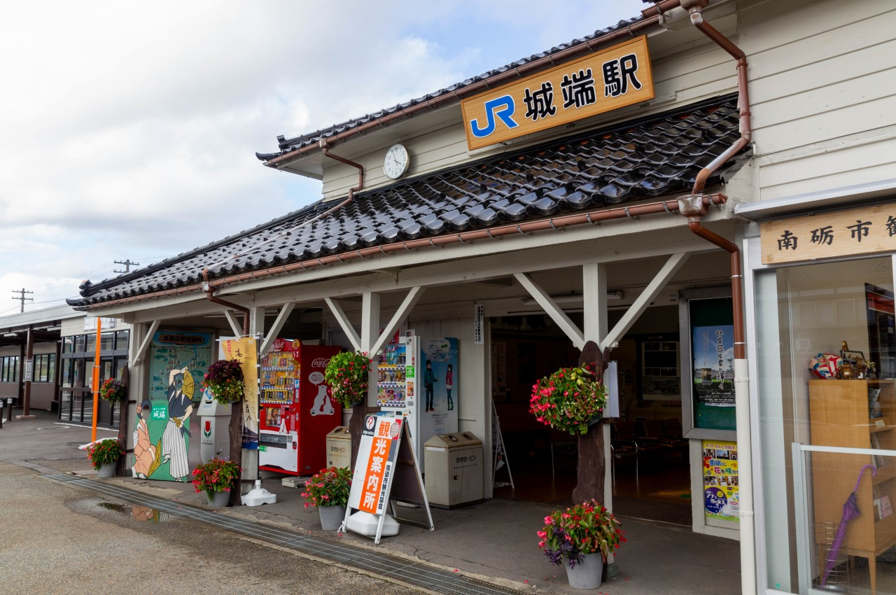
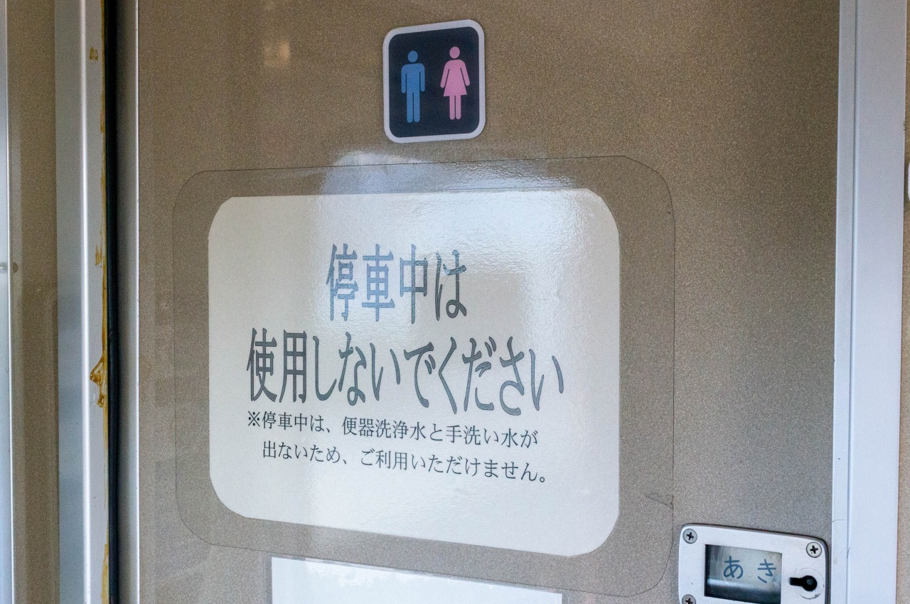
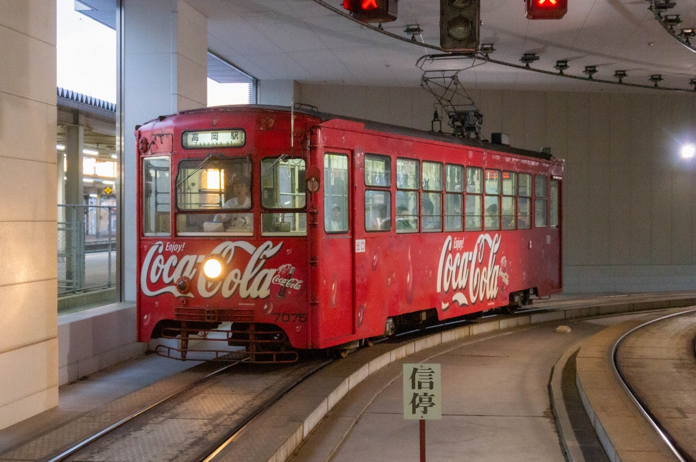
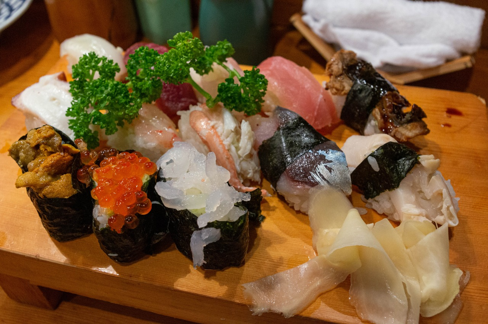

### 東海道本線 名古屋駅 → 城端線 城端駅

実施: 2018年10月

この日は実家に寝泊まりしたのにもかかわらず睡眠薬を忘れてろくに寝られず、翌朝休日診療へ飛び込んで処方してもらった。
明け方まで寝付けずげっそり。

大須で所用を済ませてから名古屋駅で駅弁を購入し、ミッドランドスクエア前からイルカ交通「きときとライナー」高岡行に乗り込んだ。
新規参入組ゆえバスターミナルを使用せず路上で客扱いする点をサービスでカバーしている。独立3列シート (しかも縦9列で広い!) で、毛布や新聞の貸し出しを行っている。
経由が若干異なる加越能バスも城端SAに停車するため連絡は可能。好きな方に乗車すれば良い。
有効期限なしのスタンプカードも渡され、6乗車で1回無料になる。

{width=5cm}
{width=5cm}

バスは名古屋高速6号清須線、16号一宮線、名神高速経由で東海北陸道へ入り、岐阜県に入って日本唯一の淡水魚専門水族館「アクア・トトぎふ」が見えたあたりで駅弁を開ける。
名古屋駅の駅弁はラインナップの入れ替わりが激しく、寄る度に買い求めてもなかなかコンプできない。
今日は「だるま」の「名古屋ベトコン弁当」。「ベストコンビ」の略と称しているが、ご当地グルメのベトコンラーメン (表向きには「ベストコンディション」の略とされる) に因んで名付けられたものとみられる。
飲み物は名鉄百貨店にある北海道アンテナショップ「どさんこプラザ」で調達したコアップガラナ。すごい組み合わせ。

{width=7.5cm}

途中ひるがの高原SAで休憩。「ひるがの高原のむヨーグルト」を買って補給。
敷地には展望台もあるものの、当時は絶賛4車線化工事中で生コン工場しか見えない。なんてこったい。

{width=7.5cm}

飛騨清見ICを過ぎると全長約11kmの飛騨トンネルに入る。
東海北陸道でも最後に開通した区間で、ボーリングマシンが動けなくなるほどの難工事だったと当時の新聞記事では度々取り上げられていた。
入口だけでなくトンネル内にも数ヶ所信号機があり、「出口○km」が流れる電光掲示板も設置されている。
しかしながら、この長さで県境をまたがないのもまた珍しい。

白川郷ICを過ぎると富山県に入る。
五箇山IC口で観光客を降ろし、城端トンネルを抜けてしばらく走ると城端SAに到着。ここで下車。
バス停は隣接するハイウェイオアシス側の駐車場にあり、P.A.WORKSのアニメスタジオが隣接している。
城ヶ池クアガーデンと呼ばれる温浴施設を併設しており、高速バスのバス停から一般道へ出ると入口にたどり着く。
ここのロータリーに南砺市コミュニティバス「城ヶ池クアガーデン」バス停があり、城端駅へ乗り継ぐことができる。
両者のバス停は目の前にあるにもかかわらず接続は考慮されておらず、高速バス側も特に乗り継ぎの案内はない。

予め接続の良い便を選んでいたのでハイウェイオアシスで時間を潰していると南砺市コミュニティバス「なんバス」が到着。
なんか凝った装飾のポンチョが来たぞ。
バスは福光駅まで向かうが城端駅で下車する。
乗車時間は短く20分程度で到着。

{width=5cm}
{width=5cm}

城端駅は木造の渋い駅舎で、観光案内所で乗車券の発売もある ~~壁には運行情報を表示するiPadが封印されていた~~。
ここからは城端線のキハ40に乗り込んで高岡を目指す。トイレには「停車中は使用しないでください」とある。水が流れないからと説明があるが、何故?
ホテルは新高岡に取っていたが、万葉線に乗りに行くのも兼ねて一旦高岡まで乗り通し、ひとまずミッションコンプリート。

{width=5cm}
{width=5cm}

コカ・コーラの広告電車に乗り込む。車内広告は10年以上前に発売された「コカ・コーラC2」の広告が未だに入っており、両替機は機械式。時代が止まっている。
Webで「万葉線で寿司を食べに行こう」なるチラシを見つけ、ノンストップで喋り続ける立川志の輔の観光アナウンスをBGMに新港の寿司屋へ向かった。

{width=5cm}
{width=5cm}

城端までの広域アクセスとしては白川郷を経由するルートも存在する。
世界遺産だけあって名古屋、金沢、高岡、城端、高山からバスが出ておりこちらでのアクセスは比較的容易。
一方で越美南線から荘川を経由して白川郷入りするルートは人口希薄地帯ゆえ2018～19年で白鳥交通のコミュニティバスや岐阜バスの高速バスが相次いで廃止され、連絡が不可能となってしまった。

